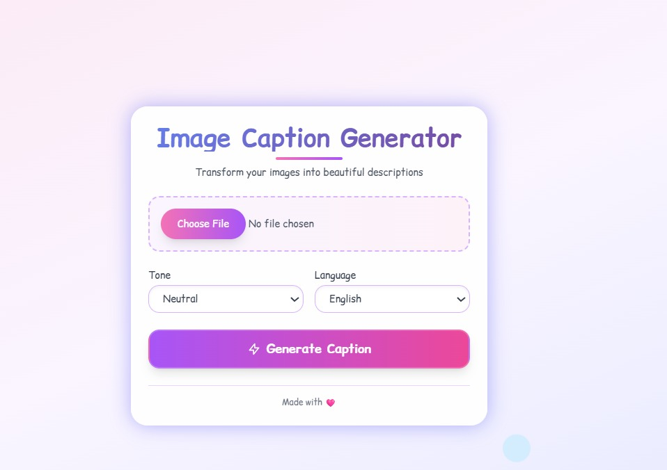

# Image Caption Generator

This project is a web application that automatically generates captions for images uploaded by users. It uses a powerful AI model from Salesforce, which is **BLIP (Bootstrapping Language-Image Pretraining)**, integrated with **Flask** (Python), **HTML**, **Tailwind CSS**, and **JavaScript**.

## Features

- Generate the caption based on user's uploaded image
- Choose the preferred language of the caption
- Choose the preffered tone of the caption
  
## How to Install

### Prerequisites

- [Docker](https://www.docker.com/products/docker-desktop)
- [Docker Compose](https://docs.docker.com/compose/)

### Installation Steps

1. **Clone the Repository**
   ```bash
   git clone https://github.com/RevokatusIvo/DPS-Project.git
   cd DPS-Project

2. **Build Docker Images**
   ```bash
   docker-compose build

3. **Run the Containers**
   ```bash
   docker-compose up -d

4. **Access the App**

   After completing step 1-3, it will open your browser automatically having http://locahost:8080 as the port.

## How to Use
1. **Upload an Image**

   Click the upload area to select an image from your device.

   The selected image will be previewed on the screen.
   
3. **Select Caption Tone**
 
   Choose from:
   - Neutral
   - Playful
   - Professional
   - Humorous
   - Poetic
   - Dramatic
     
5. **Select Preferrable Language**

    Supported language:
   - English
   - Bahasa Indonesia
   - Spanish
   - French
   - Italian
   - German
   - Portuguese
   - Russian
   - Dutch
   - Korean
   - Japanese
   - Chinese
   - Arabic
    
7. **Generate Caption**

   Click the "Generate Caption" button.

   The AI model will process the image, applying the selected tone and language.

   The generated caption will appear below the image.
   
## Tech Stack

| Frontend                  | Backend                          | AI/ML Models                                                                 |
|---------------------------|----------------------------------|------------------------------------------------------------------------------|
| HTML, JavaScript          | Python (Flask, Flask-CORS)       | **Image Captioning:** BLIP — `Salesforce/blip-image-captioning-base`        |
| Tailwind CSS              | REST API (JSON response format)  | **Translation:** MarianMT — `Helsinki-NLP/opus-mt-<lang>` (HuggingFace)     |
